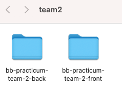

# Front-End Repo for Team 2 of Baboon/Bald Eagle Practicum

This will be the front-end for bb-practicum-team-2-back.

It is suggested that you run these instructions **after** you setup the back-end server first.
You can go through these steps during your first group meeting in-case you need assistance from your mentors.

You will have two folders inside one team folder (one for front-end and one for back-end). 

>The front-end app (React) will be running on port 3000. The back-end server will be running on port 8000. You will need to run both the front-end app and the back-end server at the same time to test your app.

### Setting up local development environment

1. Clone this repository to the folder that was already created for both the front-end and back-end repos
2. Run `npm install` to install dependencies
3. Pull the latest version of the `main` branch (when needed)
4. Run `npm start` to start the development server
5. Open http://localhost:3000 with your browser to see the data received the back-end server.
6. Now you have your front-end and back-end running locally!

#### Running the front-end server in Visual Studio Code

#### Running the front-end server in the browser
